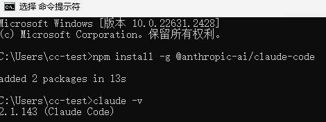
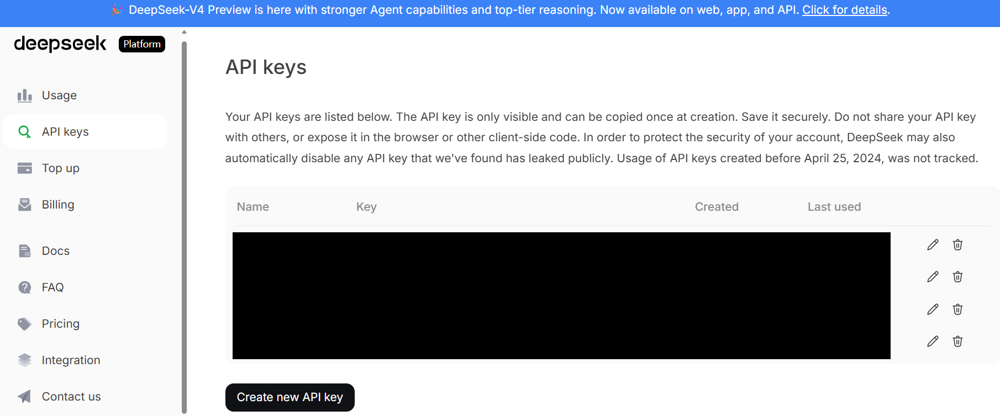
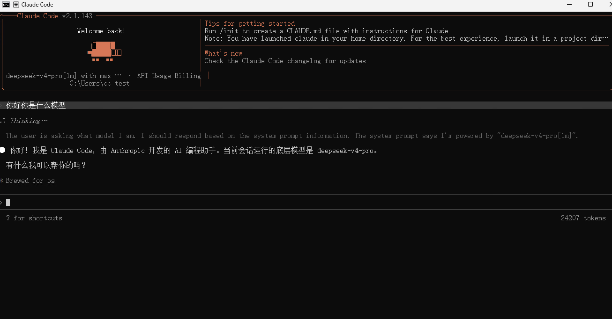

# Claude Code 指南

Claude Code 是 Anthropic 的命令行编码助手，可用于读写代码、执行命令和在终端里完成开发任务。这篇文档按依赖准备、Claude Code 安装、DeepSeek 接入、配置文件编写、启动使用和常见问题排查展开。

原版图文地址：<https://www.bilibili.com/opus/1203445769022996484>

## 安装 Git

见：[Windows/Mac/Linux/WSL 安装 Git](../../others/git.md)

## 安装 Node.js

见：[Windows/Mac/Linux/WSL 安装 Node.js](../../programme-env/nodejs.md)

## 安装 Claude Code

```bash
# 安装最新版本
npm install -g @anthropic-ai/claude-code

# 安装稳定通道版本
npm install -g @anthropic-ai/claude-code@stable

# 安装指定版本
npm install -g @anthropic-ai/claude-code@2.1.100
```

安装完成后验证：

```bash
claude --version
```

能看到版本号，就说明 CLI 已经装上了。



### 后续更新 Claude Code

如果后面需要手动更新 Claude Code，可以执行：

```bash
claude upgrade
```

本文后面的推荐配置里已经关闭了自动更新，因此后续如果想升级版本，记得手动执行这条命令。

## 申请 DeepSeek API，并把它接到 Claude Code

如果你准备直接用 Anthropic 官方账号，这一步可以略过。
国内更常见的方案：Claude Code 装在本地，后端走 DeepSeek 的 Anthropic 兼容接口。

### 先申请 DeepSeek API Key

DeepSeek 官方站点：<https://www.deepseek.com/>
API 文档：<https://api-docs.deepseek.com/zh-cn/>

1. 注册登录后，进入 API 平台，完成充值和密钥创建。
2. 目前最低充值 10 元，充值前需要实名认证。
3. 建议先小额尝试，确认自己确实会长期使用后，再按需要继续充值。
4. 创建 API Key 后，请立刻保存。平台通常不会再次完整展示同一把密钥。



DeepSeek 接入 Claude Code 的官方文档：
<https://api-docs.deepseek.com/zh-cn/quick_start/agent_integrations/claude_code>

## 配置 Claude Code

### 1. 创建或打开配置文件

```bash
# Windows 在 CMD 里执行
mkdir "%USERPROFILE%\.claude" 2>nul
if not exist "%USERPROFILE%\.claude\settings.json" (
    echo {} > "%USERPROFILE%\.claude\settings.json"
)
notepad "%USERPROFILE%\.claude\settings.json"

# Mac/Linux/WSL 在 Terminal 里执行
mkdir -p ~/.claude
if [ ! -f ~/.claude/settings.json ]; then
    echo "{}" > ~/.claude/settings.json
fi
nano ~/.claude/settings.json
# nano 保存退出方式：
# Ctrl + O
# Enter
# Ctrl + X
```

### 2. 写入示例配置

根据个人配置经验，可以参考下面这个 `settings.json` 作为推荐配置：

```json
{
  "env": {
    "ANTHROPIC_BASE_URL": "https://api.deepseek.com/anthropic",
    "ANTHROPIC_AUTH_TOKEN": "sk-0000000000000000000000000000000",
    "API_TIMEOUT_MS": "3000000",
    "ANTHROPIC_MODEL": "deepseek-v4-pro[1m]",
    "ANTHROPIC_DEFAULT_OPUS_MODEL": "deepseek-v4-pro[1m]",
    "ANTHROPIC_DEFAULT_SONNET_MODEL": "deepseek-v4-pro[1m]",
    "ANTHROPIC_DEFAULT_HAIKU_MODEL": "deepseek-v4-flash",
    "CLAUDE_CODE_SUBAGENT_MODEL": "deepseek-v4-flash",
    "DISABLE_TELEMETRY": "1",
    "CLAUDE_CODE_DISABLE_NONESSENTIAL_TRAFFIC": "1",
    "CLAUDE_CODE_DISABLE_NONSTREAMING_FALLBACK": "1",
    "CLAUDE_CODE_ATTRIBUTION_HEADER": "0",
    "CLAUDE_CODE_EFFORT_LEVEL": "max",
    "ENABLE_TOOL_SEARCH": "false",
    "DISABLE_AUTOUPDATER": "1"
  },
  "permissions": {
    "defaultMode": "default"
  },
  "language": "中文",
  "effortLevel": "high",
  "theme": "auto",
  "editorMode": "normal",
  "verbose": true
}
```

注意把 `ANTHROPIC_AUTH_TOKEN` 替换为你自己的 key。

Claude Code 环境变量官方文档：<https://code.claude.com/docs/zh-CN/env-vars>

## 启动 Claude Code

进入你的项目目录，在资源管理器的地址栏输入 `cmd`，在打开的 CMD 窗口中执行：

```cmd
claude
```

如果一切正常，Claude Code 会启动交互界面。

如果第一次进入，可能需要先选择主题，直接选自己喜欢的主题即可。

你可以先问一个很简单的问题，比如：

`你好，你是什么模型？`

如果配置正确，它通常会根据当前接入的后端模型来回答。

另外可以直接让它做一个最小任务。例如在项目目录里让它：

- 列出当前仓库顶层文件
- 解释 `README.md` 的主要内容
- 说明它当前准备使用的模型和工具环境

这样你更容易判断，到底是 CLI 没装好、Shell 不可用、仓库没识别，还是 API 配置本身出了问题。

你可以把“成功”理解成下面三个信号同时出现：

- `claude` 可以正常进入交互界面，没有启动时报错
- 它能读取当前项目目录并回答和仓库内容相关的问题
- 调用过程中没有出现明显的 `401`、`403`、余额不足、超时或模型不存在之类的错误



## 快捷启动方式

- windows 用户将 [cc.bat](./cc.bat) 下载到桌面，双击即可启动 Claude Code
- macOS 用户将 [ccmac.sh](./ccmac.sh) 文件下载到 `~/.claude` 下
- Linux/WSL 用户将 [cclinux.sh](./cclinux.sh) 文件下载到 `~/.claude` 下

```bash
# Mac
# 写入 zsh 启动配置
grep -qxF 'source ~/.claude/ccmac.sh' ~/.zshrc || echo 'source ~/.claude/ccmac.sh' >> ~/.zshrc
# 立即生效
source ~/.zshrc

# Linux/WSL
# 写入 bash 启动配置
grep -qxF 'source ~/.claude/cclinux.sh' ~/.bashrc || echo 'source ~/.claude/cclinux.sh' >> ~/.bashrc
# 立即生效
source ~/.bashrc

# 后续直接在终端中使用 cc 启动
cc
```

- 使用前建议根据实际情况修改 `base` 项目根目录，例如设置为 `D:\workspace`，用于存放和管理所有项目；
- 脚本会自动列出项目根目录下的一级项目文件夹，也支持创建新项目并自动进入对应目录；
- 启动时会自动扫描 `%USERPROFILE%\.claude` 下的 `settings*.json` 配置文件，可按需选择不同的 Claude 配置；
- 脚本默认带有 `--dangerously-skip-permissions` 参数，用于跳过部分权限确认提示；该参数风险较高，建议仅在可信项目目录中使用，如不需要可从脚本最后的 `claude ...` 启动命令中删除；
- 请确保 BAT 文件保存为 **UTF-8（无 BOM）** 编码和 **CRLF** 换行格式，避免中文乱码或命令解析异常；
- 如需调整目录结构、启动参数、权限确认方式或其他行为，可直接让 Agent 根据需求修改脚本。

## 全局指令

CLAUDE.md 是 Claude Code 读取的项目/用户级指令文件，作用是告诉编码智能体“项目怎么构建、测试、改代码、遵守哪些规范”；通常放在项目根目录，必要时也可放在子目录做局部规则，用户全局规则则分别放在对应工具支持的用户配置目录中。

本人使用指令文件参考：

[CLAUDE.md](./CLAUDE.md)

可以下载后放到 `%USERPROFILE%/.claude` 下或者项目根目录的 `.claude` 文件夹下。

## 常见问题

### 1. `claude` 命令找不到

通常从这几个方向查：

- Node.js 是否真的安装成功
- npm 全局安装目录是否在 PATH 中
- 你是不是装完后没有重开终端
- Git 和 Node.js 是否装在了非默认目录

如果你是用 npm 安装的，也可以执行：

```bash
npm list -g @anthropic-ai/claude-code
```

先确认包到底有没有装上。

### 2. npm 下载太慢或超时

先看 registry：

```bash
npm config get registry
```

如果不是 `https://registry.npmmirror.com`，就重新切一下。

### 3. Claude Code 能启动，但模型调用失败

优先检查这几项：

- `ANTHROPIC_BASE_URL` 是否写成了 `https://api.deepseek.com/anthropic`
- `ANTHROPIC_AUTH_TOKEN` 是否是真实有效的 DeepSeek key
- 模型名是否和当前 DeepSeek 文档一致
- 账户余额、额度、风控或限流是否正常
