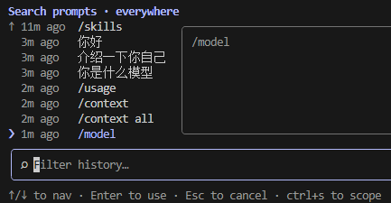

# Claude Code 交互模式

这篇文档聚焦 Claude Code 的交互方式和键盘操作，适合快速上手终端内编辑体验。内容按常规控制、文本编辑、多行输入和历史搜索四部分组织。

> **参考来源**
>
> - 官方文档首页：<https://code.claude.com/docs/zh-CN/>
> - 交互模式：<https://code.claude.com/docs/zh-CN/interactive-mode>

---

## 常规控制快捷键

| 快捷键 | 描述 |
| --- | --- |
| `Ctrl+C` | 取消当前输入或生成 |
| `Ctrl+D` | 退出 Claude Code 会话 |
| `Ctrl+O` | 切换转录查看器，显示详细的工具使用和执行情况。还会展开 MCP 调用 |
| `Ctrl+B` | 后台运行 bash 命令和代理。Tmux 用户按两次 |
| `Ctrl+T` | 切换任务列表，在终端状态区域中显示或隐藏 |
| `Esc` | 中断 Claude，停止当前响应或工具调用中途，以便你可以重定向。Claude 保留迄今为止完成的工作 |
| `Esc + Esc` | 回退或总结，将代码和/或对话恢复到上一个点，或从选定消息进行总结 |
| `Shift+Tab` | 循环权限模式，在 `default`、`acceptEdits`、`plan` 和你启用的任何模式之间循环 |
| `Alt+P` | 切换模型，在不清除提示的情况下切换 |
| `Alt+T` | 切换扩展思考模式 |

## 文本编辑快捷键

| 快捷键 | 描述 |
| --- | --- |
| `Ctrl+A` | 将光标移动到当前行的开始 |
| `Ctrl+E` | 将光标移动到当前行的末尾 |
| `Ctrl+K` | 删除到行尾，存储已删除的文本以供粘贴 |
| `Ctrl+U` | 从光标删除到行首，存储已删除的文本以供粘贴 |
| `Ctrl+W` | 删除上一个单词，存储已删除的文本以供粘贴 |
| `Ctrl+Y` | 粘贴用 `Ctrl+K`、`Ctrl+U` 或 `Ctrl+W` 删除的文本 |
| `Ctrl+S` | 暂存未发送的提示词，在下次提交后恢复，或清空输入内容后 `Ctrl+S` 直接恢复 |
| `Alt+Y`（在 `Ctrl+Y` 之后） | 循环粘贴历史，浏览以前删除的文本 |
| `Alt+B` / `Alt+F` | 将光标向后/向前移动一个单词 |

## 多行输入方法

| 快捷键 | 描述 |
| --- | --- |
| `\` + `Enter` | 在所有终端中工作的通用续行 |
| `Ctrl+Enter` | 直接换行，Windows Terminal 等开箱即用；部分终端需 `/terminal-setup` |
| `Ctrl+J` | 发送 LF 换行符，在任何终端中工作无需配置 |
| 直接粘贴 | 自动识别换行；超 10,000 字符折叠为 `[Pasted text]` |
| `Ctrl+G` | 在默认文本编辑器中打开以编辑后提交 |

## 命令历史与搜索

- **历史特性** — 输入历史按工作目录存储，`/clear` 重置，向上/向下箭头导航

- **Ctrl+R 反向搜索历史提示词** — 1. 按 Ctrl+R 激活 → 2. 键入查询 → 3. Tab/Esc 接受，Enter 执行 → 4. ESC 取消

- **搜索范围** — 默认搜索所有项目，按 Ctrl+S 在 此会话/此项目/所有项目 间循环
  - Search prompts · session
  - Search prompts · project
  - Search prompts · everywhere
