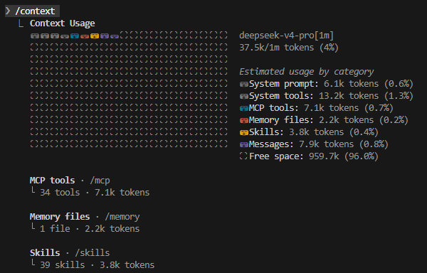
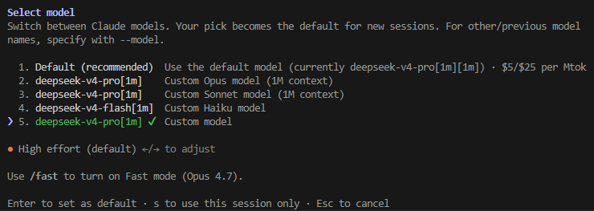
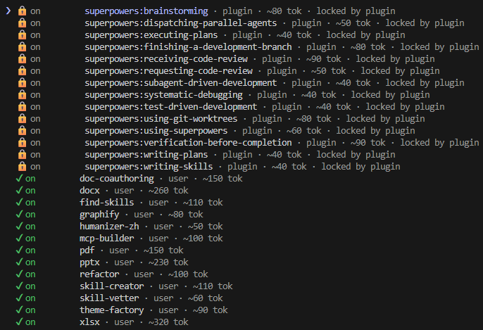
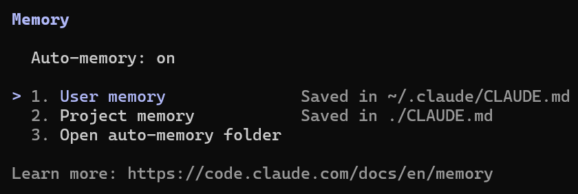

# Claude Code 常用命令

这篇文档是 Claude Code 命令速查，适合在会话里快速判断某个命令该放在哪一类使用。结构上先总览，再按会话管理、模型设置、项目工具、开发工作流、并行后台、诊断工具和配置环境分组。

> **参考来源**
>
> - 官方文档首页：<https://code.claude.com/docs/zh-CN/>
> - 命令参考：<https://code.claude.com/docs/zh-CN/commands>

---

## 命令概述

- 命令在会话内控制 Claude Code，提供快速切换模型、管理权限、清除上下文、运行工作流等功能
- 输入 `/` 查看所有可用命令，或 `/` + 字母筛选

## 会话管理命令

| 命令 | 用途 |
| --- | --- |
| `/clear [name]` | 使用空上下文启动新对话。之前的对话在 `/resume` 中保持可用。传递名称以标记之前的对话。别名：`/reset`、`/new` |
| `/compact [instructions]` | 通过总结对话来释放上下文。可选传递焦点说明以进行总结 |
| `/resume [session]` | 按 ID 或名称恢复对话，或打开会话选择器。别名：`/continue` |
| `/branch [name]` | 在此点创建当前对话的分支。别名：`/fork` |
| `/rename [name]` | 重命名当前会话并在提示栏上显示名称。不使用名称时，从对话历史自动生成 |
| `/export [filename]` | 将当前对话导出为纯文本。使用文件名时直接写入；不使用时打开对话框复制或保存 |
| `/copy [index]` | 将最后一个助手响应复制到剪贴板。传递数字以复制第 N 个最新响应；有代码块时显示交互式选择器 |
| `/context` | 将当前上下文使用情况可视化为彩色网格 |

### `/context` 命令

执行 `/context` 命令后，Claude Code 会显示当前上下文的信息，包括上下文大小、剩余 token 数量、已使用 token 数量、已使用 token 百分比等。这些信息可以帮助你了解当前上下文的使用情况，以及是否需要清理上下文以释放更多 token 空间。

## 模型与设置命令

| 命令 | 用途 |
| --- | --- |
| `/model [model]` | 选择或更改 AI 模型。对于支持的模型，使用左/右箭头调整工作量级别 |
| `/effort [level:auto]` | 设置模型工作量级别。接受 `low`、`medium`、`high`、`xhigh` 或 `max`；`auto` 重置为默认值 |
| `/fast [on/off]` | 切换快速模式开启或关闭 |
| `/config` | 打开设置界面调整主题、模型、输出样式和其他偏好设置。别名：`/settings` |
| `/usage` | 显示会话成本、计划使用限制和活动统计。别名：`/cost`、`/stats` |

### `/model` 命令

执行 `/model` 命令后，Claude Code 会显示当前使用的模型名称和版本。通过上/下方向键来选择不同的模型，使用左/右箭头调整模型努力程度。

## 项目与工具命令

| 命令 | 用途 |
| --- | --- |
| `/init` | 使用 `CLAUDE.md` 指南初始化项目。设置 `CLAUDE_CODE_NEW_INIT=1` 以获得交互式流程 |
| `/permissions` | 管理工具权限的允许、询问和拒绝规则。别名：`/allowed-tools` |
| `/mcp` | 管理 MCP server 连接和 OAuth 身份验证 |
| `/skills` | 列出可用的 skills。按 `t` 按令牌计数排序 |
| `/plugin` | 管理 Claude Code plugins |
| `/theme` | 更改颜色主题。包括 `auto` 选项、色盲友好主题和自定义主题 |

### `/skills` 命令

执行 `/skills` 命令后，会列出所有可用技能，包括官方和社区贡献的插件。这些技能可以扩展 Claude Code 的功能，例如与外部服务集成、执行特定任务等。

## 开发工作流命令

| 命令 | 用途 |
| --- | --- |
| `/goal [condition\|clear]` | 设置一个目标：Claude 在多个轮次中继续工作，直到满足条件。`clear`/`stop`/`reset` 移除活跃目标 |
| `/plan [description]` | 直接从提示进入 Plan Mode。传递可选描述以立即开始任务 |
| `/simplify [focus]` | 审阅最近更改的文件以查找代码重用、质量和效率问题，然后修复它们。传递文本以集中关注特定问题 |
| `/security-review` | 分析当前分支上的待处理更改以查找安全漏洞 |
| `/diff` | 打开交互式差异查看器，显示未提交的更改和每轮差异 |

## 并行与后台命令

| 命令 | 用途 |
| --- | --- |
| `/agents` | 管理 agent 配置 |
| `/tasks` | 列出并管理后台任务 |
| `/background [prompt]` | 将当前会话分离以作为后台 agent 运行并释放终端。别名：`/bg` |
| `/batch <instruction>` | 在整个代码库中并行编排大规模更改。将工作分解为独立单元，在每个 worktree 中运行 subagent 并打开 PR |
| `/btw <question>` | 提出快速附加问题，无需添加到对话历史 |

## 实用工具与诊断命令

| 命令 | 用途 |
| --- | --- |
| `/rewind` | 将对话和/或代码倒回到上一个点，或从选定消息进行总结。别名：`/checkpoint`、`/undo` |
| `/doctor` | 诊断并验证 Claude Code 安装和设置。按 `f` 让 Claude 修复问题 |
| `/debug [desc]` | 为当前会话启用调试日志记录并排查问题 |
| `/recap` | 按需生成当前会话的单行摘要 |

## 配置与环境命令

| 命令 | 用途 |
| --- | --- |
| `/hooks` | 查看工具事件的 hook 配置 |
| `/keybindings` | 打开或创建快捷键配置文件 |
| `/memory` | 编辑 `CLAUDE.md` 内存文件，启用或禁用 auto-memory，并查看自动内存条目 |
| `/add-dir <path>` | 为当前会话期间的文件访问添加工作目录。大多数 `.claude/` 配置不会从添加的目录中发现 |

### /memory 说明

> `/memory` 是 `CLAUDE.md` 和 `MEMORY.md` 的入口。

#### `CLAUDE.md` 与 `MEMORY.md` 的区别

| 文件 | `CLAUDE.md` | `MEMORY.md` |
| --- | --- | --- |
| 内容 | 项目指令、规则、规范 | 用户偏好、反馈、项目上下文、外部引用 |
| 写入者 | 用户手动编写 | Agent 自动写入（用户也可要求写入） |
| 加载时机 | 每次对话自动加载到上下文 | Agent 判断相关性时主动读取 |
| 结构与格式 | 单一纯 Markdown 文件 | 多个主题文件（Markdown + frontmatter）+ `MEMORY.md` 索引 |
| 位置（项目级） | `<project>/` 或 `<project>/.claude/` | `<project>/.claude/memory/` |
| 位置（全局级） | `~/.claude/` | `~/.claude/projects/<project>/memory/` |
| 粒度 | 全局规则，对所有对话生效 | 按话题拆分，按需加载 |
| 优先级 | 最高，Agent 必须遵守 | 参考性质，由 Agent 判断是否适用 |

简单来说：

- `CLAUDE.md` = 你给 Agent 的"规章制度"，属于硬性规则
- 记忆文件（Memory） = Agent 积累的"经验笔记"，属于上下文参考

例如：

- 如果 `CLAUDE.md` 中写：
  - "所有响应必须使用中文"
  - 那么这是强制规则，Agent 必须遵守

- 如果记忆文件中记录：
  - "用户偏好使用表格展示参数"
  - 那么这是偏好信息，Agent 会优先参考，但并非绝对强制
