# Hyper-V 指南

Hyper-V 是 Windows 自带的虚拟化平台，可用于创建和运行虚拟机。这篇文档按“启用 Hyper-V -> 创建虚拟机 -> 安装 Windows 11”的顺序展开，中间补了硬件检查、TPM、联网与本地账户等关键细节。

## 安装 Hyper-V

这一部分只针对想走虚拟机方案的读者。

先说明边界：下面的内容只用于 Windows 11 虚拟机的学习、测试和开发环境搭建，不涉及破解、盗版激活、绕过授权或者修改系统镜像。镜像建议优先使用微软官方 ISO，并自行准备合法授权。

### 先看自己是否满足条件

这一步很有必要，因为不少人不是装错了，而是一开始机器条件就不满足。

你至少要确认下面几件事：

- 当前 Windows 版本支持 Hyper-V。专业版、企业版、教育版通常没有问题，Home 版默认往往不带完整 Hyper-V 能力
- BIOS 或 UEFI 里已经开启硬件虚拟化，常见名称包括 `Intel VT-x`、`Intel Virtualization Technology`、`AMD-V` 或 `SVM Mode`
- 机器内存和磁盘空间够用。要让虚拟机跑得别太难受，通常至少要预留 4 GB 内存和几十 GB 磁盘空间

在 Windows 里可以先打开任务管理器，进入 `性能 -> CPU`，确认右下角的 `虚拟化` 是否显示为 `已启用`。

如果没有启用，推荐先进入 BIOS / UEFI 检查。比较省事的进入方式是先在 CMD 或 PowerShell 中执行：

```cmd
shutdown /r /fw /t 0
```

这条命令会重启并直接进入固件设置界面。不同主板菜单名称不一样，但核心就是找到虚拟化相关选项并启用它。

如果你执行启用 Hyper-V 的命令时报功能不存在，先不要反复重试，优先回头确认 Windows 版本和 BIOS 虚拟化状态。

### 开启 Hyper-V

用管理员权限打开 PowerShell 或 CMD。

- 按 `Win + X`
- 选择 `终端（管理员）` 或 `Windows PowerShell（管理员）`

执行：

```powershell
dism.exe /Online /Enable-Feature /All /FeatureName:Microsoft-Hyper-V
```

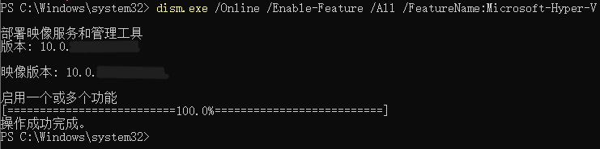

命令跑完后，按提示重启电脑。

### 准备 Windows 11 镜像

微软官方下载地址：

<https://www.microsoft.com/en-us/software-download/windows11>

如果官方下载速度不理想，可以自行评估下面这些第三方镜像分发站点，但我更建议优先确认来源可靠性：

- <https://xspt.ustc.edu.cn>
- <https://sysin.org/blog/windows-11>
- <https://msdn.sjjzm.com/win11.html>
- <https://uupdump.net/>

本教程使用的是 Windows 11 专业版 64 位简体中文镜像，其他版本理论上也可以，只要满足你的使用场景即可。

示例镜像名：

`SW_DVD9_Win_Pro_11_23H2_64BIT_ChnSimp_Pro_Ent_EDU_N_MLF_X23-59583s.ISO`

## 第二步：创建虚拟机

### 打开 Hyper-V 管理器

在开始菜单搜索 `Hyper-V`，打开 `Hyper-V 管理器`。

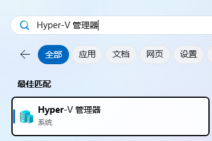

### 新建虚拟机

在右侧操作栏点击 `新建` -> `虚拟机`。

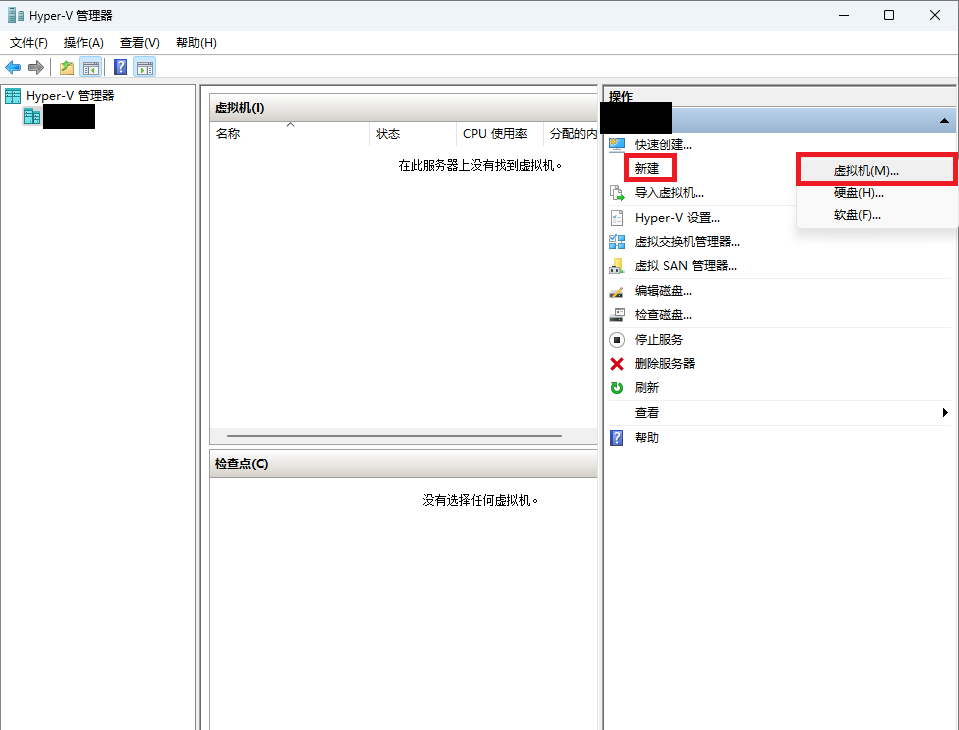

### 按向导完成基础配置

这一段不复杂，关键是别把几个容易忽略的选项点错。

1. 指定名称和位置
   - 名称可以自定义，例如 `cctest`
   - 建议把虚拟机存放到系统盘之外，例如 `D:\Hyper-V`
2. 指定代数
   - 选择 `第二代`
3. 分配内存
   - 启动内存可以先用默认的 `4096 MB`
4. 配置网络
   - 一般先选 `Default Switch`
5. 连接虚拟硬盘
   - 选择创建新的虚拟硬盘
   - 大小可以先给 `40 GB` 作为起点
6. 安装选项
   - 选择 `从可启动的映像文件安装操作系统`
   - 浏览并选中你准备好的 Windows 11 ISO

完成后界面大致如下：

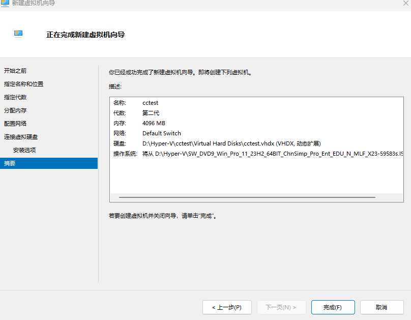

### 启用 TPM

Windows 11 对安全启动和 TPM 有要求。你如果用的是第二代虚拟机，通常需要把 TPM 打开，不然后面安装阶段容易卡住。

操作入口一般是：

1. 在 `Hyper-V 管理器` 里选中虚拟机
2. 点击 `设置`
3. 进入 `安全`
4. 勾选 `启用受信任的平台模块`

如果你看到的界面名称略有差别，不用紧张，核心就是在虚拟机的 `安全` 配置页里把 `安全启动` 和 `TPM` 相关选项打开。

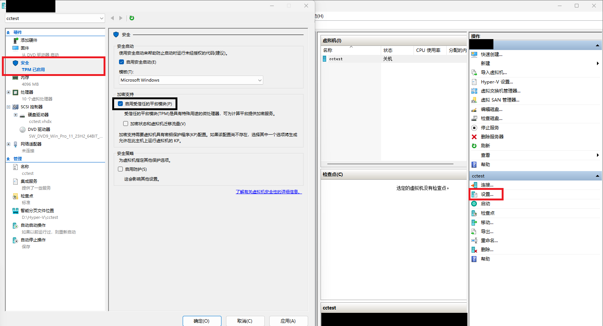

## 第三步：在虚拟机里安装 Windows 11

点击 `连接`，启动虚拟机，再点击 `启动`。

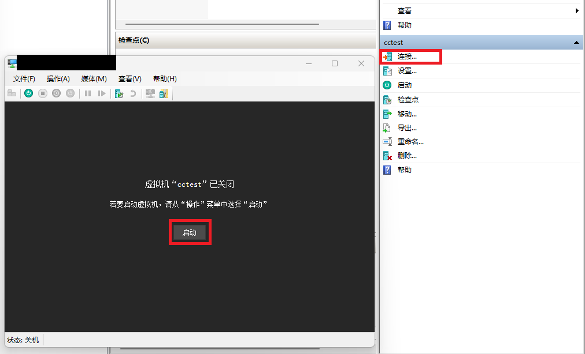

如果启动页出现：

`Press any key to boot from CD or DVD...`

记得马上按任意键，否则会错过引导。

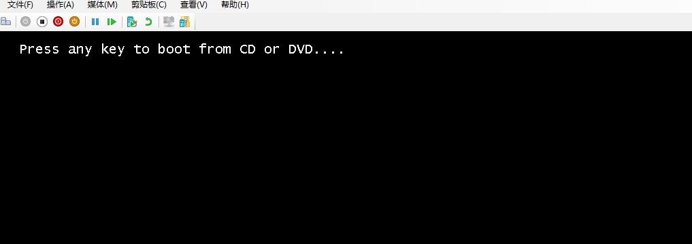

如果错过了，直接强制关机后重新启动即可。

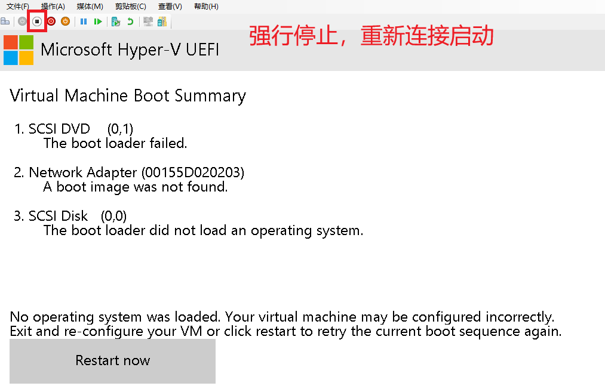

### 开始安装系统

按安装向导一步步走，重点注意两处：

- 操作系统版本可以选 `Windows 11 专业版`
- 安装类型一般选 `自定义：仅安装 Windows`

### 关于联网安装和本地账户

这里是很多人第一次装 Windows 11 虚拟机时最容易卡住的地方。

从 Windows 11 22H2 开始，OOBE 阶段对联网和账户的要求明显变严格了。安装时大致有两条路。

- 断网安装：需要宿主主机先断网，可以跳过安装过程中的自动更新，后面再通过命令跳过微软账户登录，优点是更稳，变量更少
- 联网安装：不需要宿主主机断网，但安装过程中可能自动更新，后续更容易因为版本变化导致本地账户创建方式失效

如果你后面发现联网安装失败，或者本地账户相关命令不生效，可以优先考虑让宿主主机先断网，走断网安装，等系统进入桌面后再联网。

#### 方案一：断网安装

如果你打算全程断网安装，在 OOBE 页面按 `Shift + F10` 打开命令提示符，输入：

```cmd
oobe\bypassnro
```

这条命令的作用是跳过网络要求。执行后系统会自动重启，再次进入 OOBE 时，通常会出现 `我没有 Internet 连接` 之类的选项。

后续按提示继续：

- 选择 `我没有 Internet 连接`
- 选择 `继续执行受限设置`
- 设置本地用户名、密码和安全问题
- 隐私相关开关如果没有特别需求，可以先全部关闭

对应界面示意：

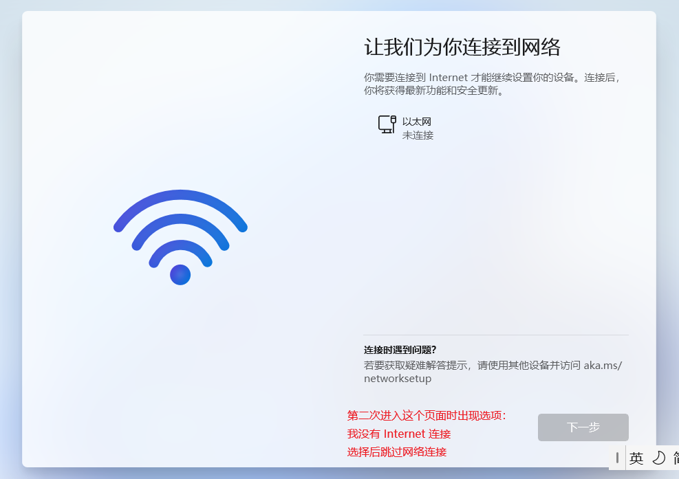

#### 方案二：联网安装后再创建本地账户

如果你选择联网安装，系统通常会继续推动你使用微软账户。

可以尝试下面这条命令：

```cmd
start ms-cxh:localonly
```

这条方式在部分 Windows 11 版本中可用，作用是直接拉起本地账户创建流程。但我要提醒一句，它不是微软公开长期承诺的标准入口，后续版本是否保留，取决于系统改动。

如果你当前系统版本还能用，后面继续设置用户名、密码和安全问题即可。

执行命令的页面如下：

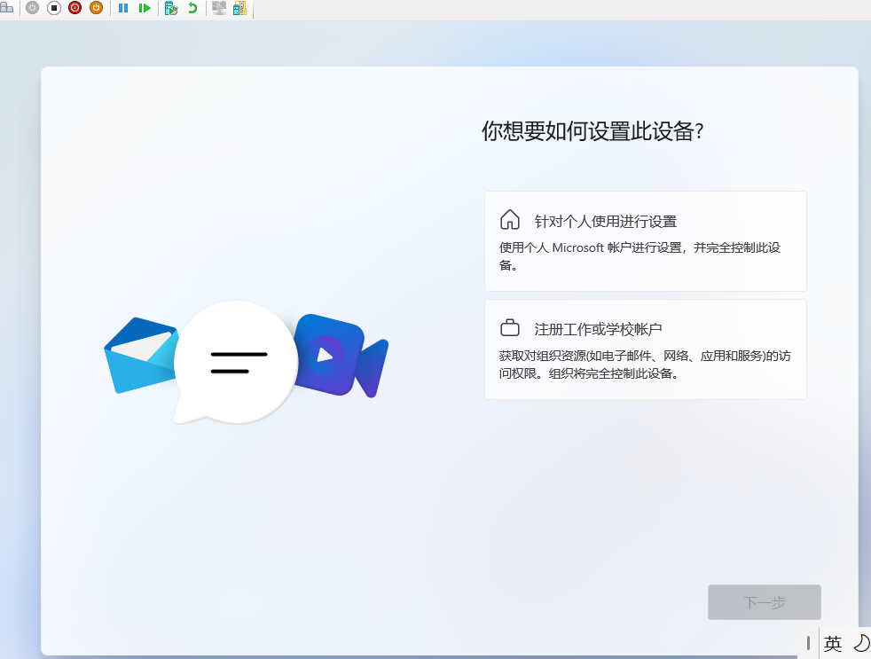

### 一个容易忽略的小细节

虚拟机名称和 Windows 用户名最好不要完全一样。比如虚拟机叫 `cctest`，系统用户名可以设成 `cc-test`。这样后面看日志、看路径时会更容易区分。

### 这两条命令到底算什么

`oobe\bypassnro` 和 `start ms-cxh:localonly` 的作用，都是帮助你在测试环境里更方便地完成初始化设置。

它们不等于激活 Windows，也不会替你绕过正版验证或许可要求。这一点需要说清楚。

如果这两条路都失效，别在这里卡太久，直接按下面的顺序处理会更省时间：

1. 先确认当前系统版本号
2. 优先尝试离线初始化，也就是回到 `oobe\bypassnro` 方案
3. 如果必须联网初始化，就按你当前 Windows 版本重新查当下可用的方法，不要默认旧命令一定还生效

### 进入系统桌面

安装完成后，进入 Windows 11 主页面。

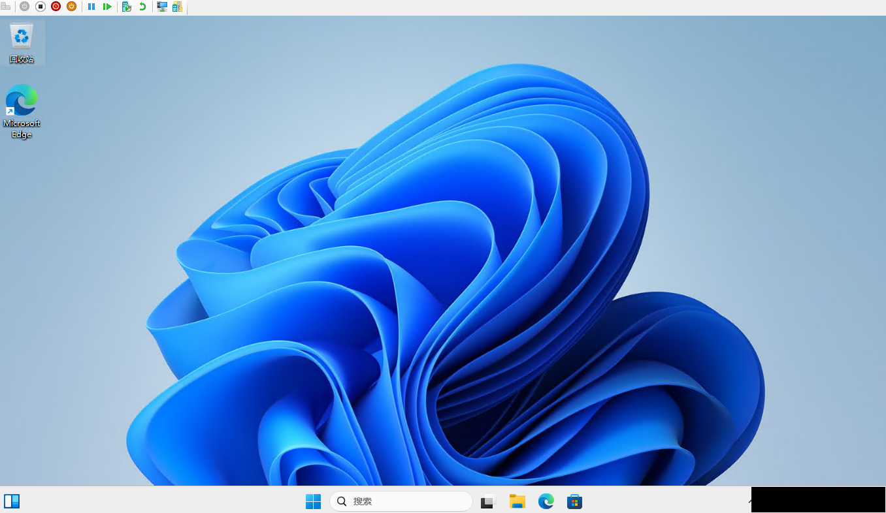

到这里，虚拟机里的操作系统环境就算准备好了。
