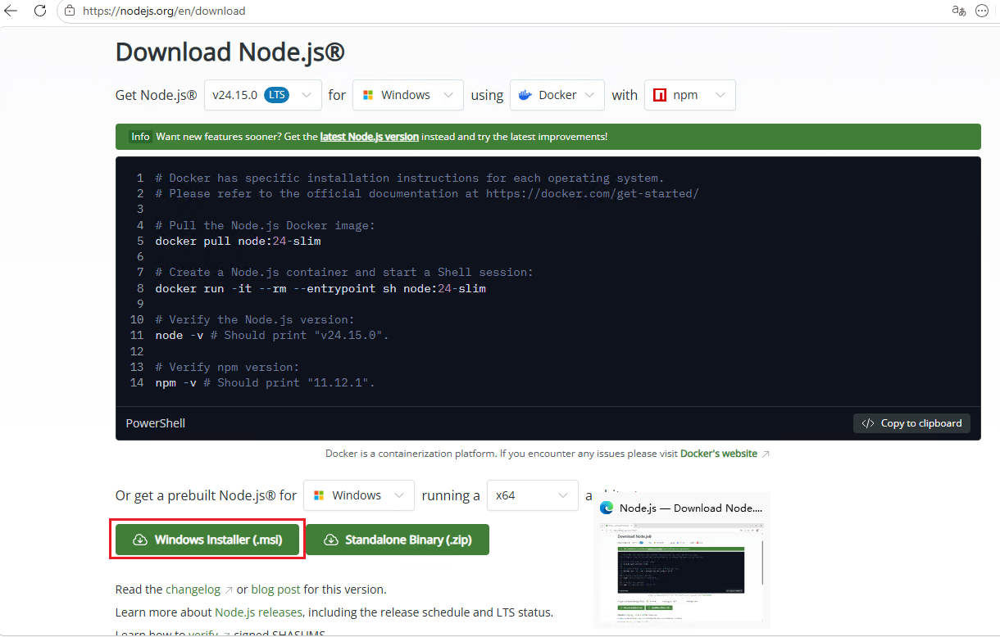

# nodejs 指南

Node.js 是 JavaScript 运行时，也是 `npm` 生态和大量前端/CLI 工具的基础。这篇文档先整理 Node.js 安装，再补环境变量配置，最后说明 `npm` 镜像设置。

## 安装 node

nodejs 下载地址：

<https://nodejs.org/en/download>

示意图：



安装时选择默认选项即可。

## 配置环境变量

打开命令行，输入以下命令：

```bash
# 添加到用户变量
setx PATH "%PATH%;C:\Program Files\nodejs"
# 检查 Node.js 版本
node -v
npm -v
npx -v
```

## 配置镜像

```bash
# npm：用命令设置 npm registry
npm config set registry https://registry.npmmirror.com

# npm：查询当前 registry
npm config get registry

# 文件位于：C:\Users\用户名\.npmrc，type 打印检查
type "%USERPROFILE%\.npmrc"
```
